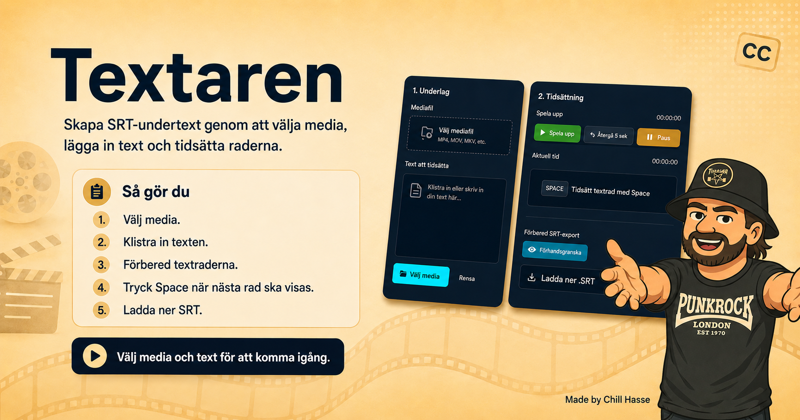

# Textaren



**Textaren** är en webapp för att skapa SRT-undertexter från en lokal ljud- eller videofil.

Du väljer media, klistrar in texten och tidsätter raderna under uppspelning. När tiderna är klara kan du exportera resultatet som `.srt`.

## Viktigt om filer och integritet

Allt sker lokalt i webbläsaren. Mediafilen du väljer laddas inte upp till servern, och SRT-filen som skapas sparas inte heller på servern. SRT-filen skapas i webbläsaren och laddas ner direkt till din dator.

## Funktioner

- Välj lokal ljud- eller videofil.
- Klistra in sångtext, dialog eller undertext.
- Förbered textrader automatiskt från inklistrad text.
- Tidsätt nästa rad med `Space` under uppspelning.
- Justera timing med små tidssteg.
- Ångra senaste tidsättning.
- Förbered och ladda ner SRT-export.
- Media hanteras lokalt i webbläsaren med `URL.createObjectURL()` och laddas inte upp till servern.
- SRT-exporten skapas lokalt i webbläsaren och sparas inte på servern.

## OpenGraph-bild

Aktuell OG-bild ligger här:

```text
image/textaren_og_2.png
```

Den används av sidan som förhandsbild för Facebook, Messenger, X/Twitter och andra tjänster som läser OpenGraph-taggar.

## Nuvarande läge

- `textare.php` är en komplett fristående sida.
- Appen laddar lokala, relativa filer:
  - `style.css`
  - `assets/textare/textare.css`
  - `assets/textare/app.js`
  - `image/*`
- Katalogen kan byta namn eftersom sidan inte har hårdkodad base URL till appens egna filer.
- Exporten är fokuserad på SRT.

## Filstruktur

```text
textaren/
├── textare.php
├── index.php
├── style.css
├── media.css
├── assets/
│   └── textare/
│       ├── app.js
│       └── textare.css
├── image/
│   ├── textaren_og_2.png
│   └── övriga favicon-/bildfiler
└── docs/
```

## Kontroller

Kör från projektroten:

```bash
php -l textare.php
node --check assets/textare/app.js
```

## Publicerad sida

```text
https://www.aberg.online/textaren/textare.php
```

## Made by

Made by Åberg / Chill Hasse 2026.
